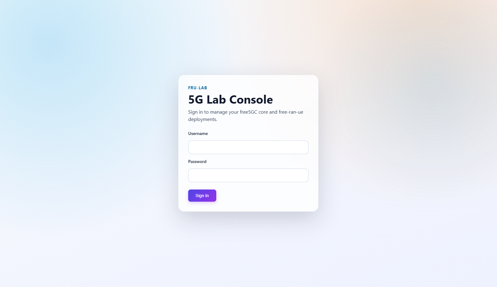
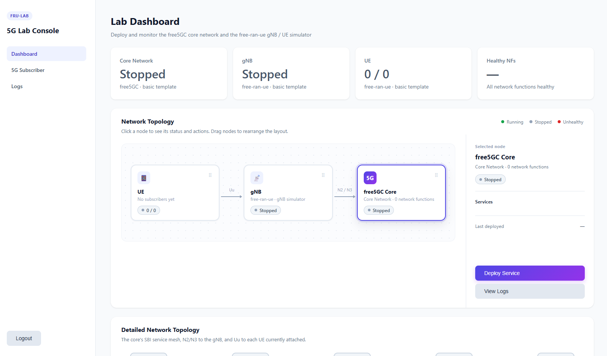
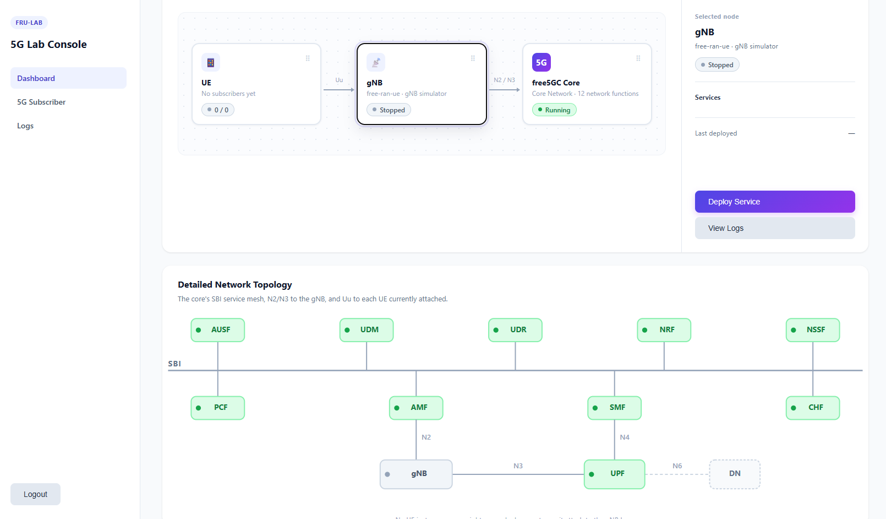
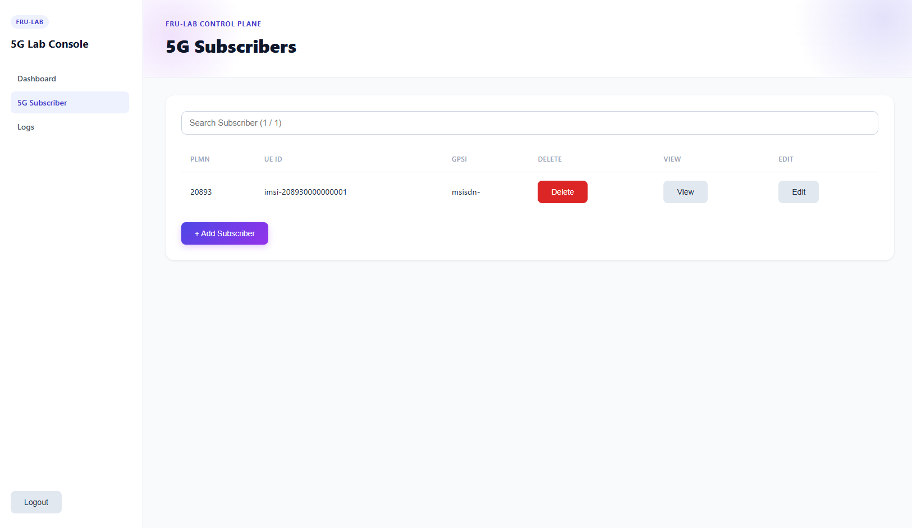
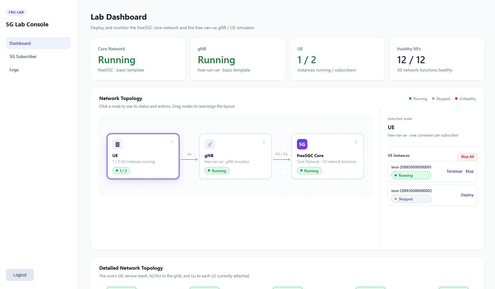
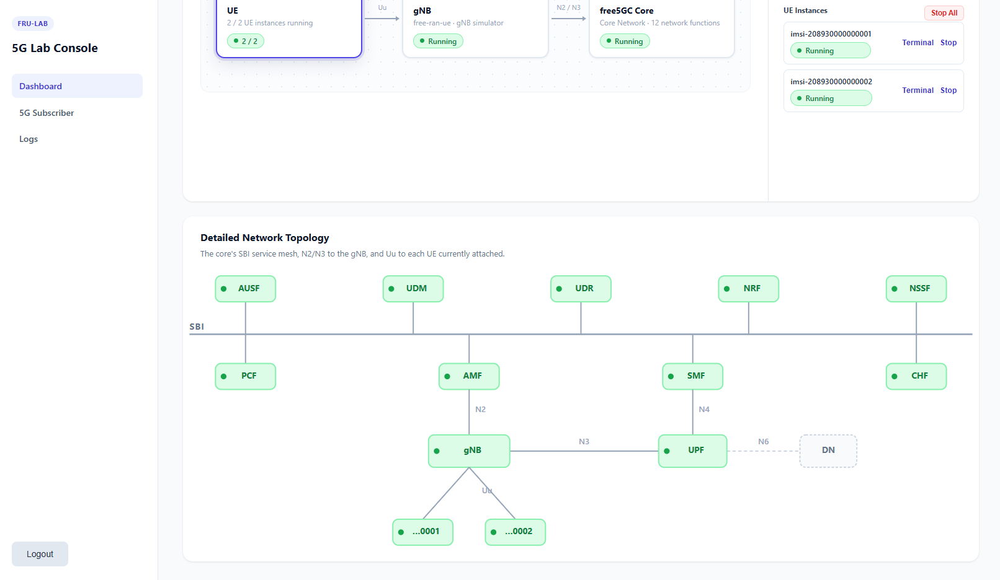
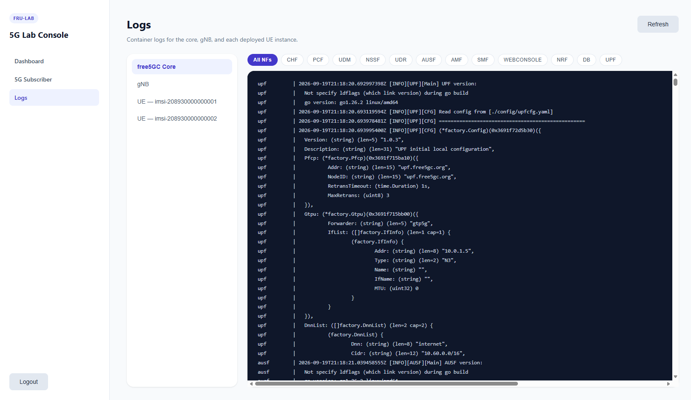
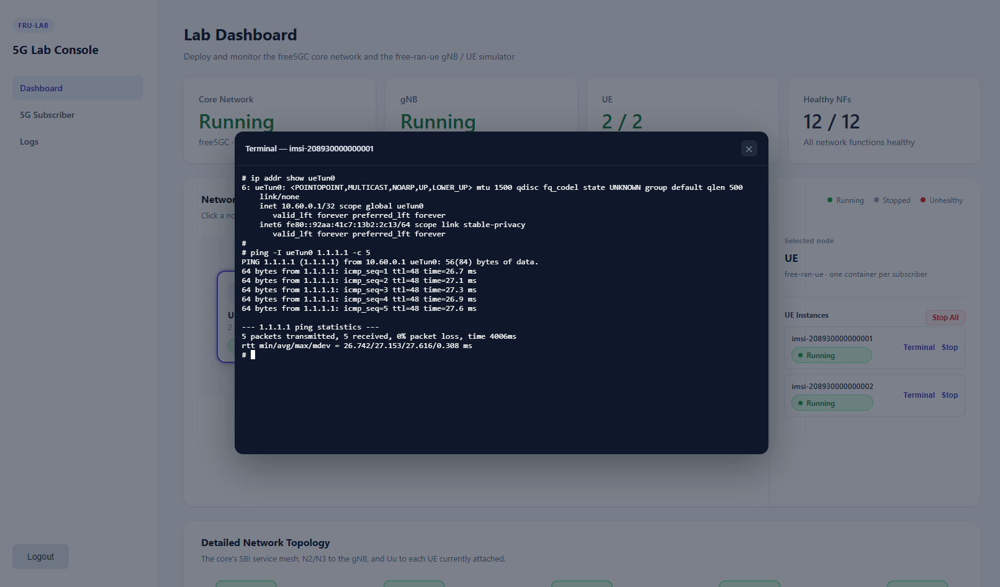

# fru Lab

Deploy and monitor the free5GC core network and the free-ran-ue gNB / UE simulator.

## Develop Environment

| DevOpts | Version |
| - | - |
| OS | Ubuntu 25.04 |
| go | 1.26.2 |
| nodejs | v20.20.0 |
| yarn | 1.22.22 |

## Make

| Type | Command |
| - | - |
| Make all | `make` |
| Backend | `make backend` |
| Frontend | `make frontend` |
| Run | `make run` |
| Tidy | `make tidy` |
| Lint | `make lint` |
| Generate frontend openapi | `make openapi` |
| Generate frontend openapi for free5GC webconsole | `make openapi-webconsole` |

## Guide

After starting the app with `make run`, open it in your browser with port `http://<ip>:8888` to get started.

### 1. Login

Sign in with username and password.

- username: `admin`
- password: `frulab`

### 2. Dashboard overview

After logging in you land on the Dashboard, which shows a simple topology of the Core / gNB / UE nodes along with stats cards at the top. Click a node to see its details and Deploy / Stop actions on the right.

### 3. Deploy / stop order

The system enforces a `Core -> gNB -> UE` order for both deploying and stopping, to avoid leaving the network in an inconsistent state:

- Deploy: Core must be deployed before gNB, and gNB must be deployed before any UE.
- Stop: all UEs must be stopped before gNB, and gNB must be stopped before Core.

If the current state doesn't satisfy the order, the corresponding button is disabled and shows the reason.

### 4. Deploy Core / gNB

Click the Core or gNB node in the topology to see its current status and container details, with Deploy / Stop buttons. Once Core is deployed, its 9 network functions (AMF, SMF, UPF, etc.) show their health below.

### 5. Add a 5G Subscriber

Open "5G Subscriber" in the left sidebar to create / edit / delete UE subscriber data (IMSI, key, slice, etc.), which is used to deploy the matching UE.

### 6. Deploy a UE

Back on the Dashboard, click the UE node to see all subscribers listed on the right. Click "Deploy" on any row to start that UE's container, or "Stop All" to stop every running UE at once.

### 7. Detailed network topology

Below the main topology, a more detailed diagram shows the live SBI service mesh, N2/N3 links, and the Uu link between gNB and each currently running UE.

### 8. View logs

The "Logs" page in the sidebar shows live logs for Core / gNB / each UE. When Core is selected, logs can also be filtered by individual network function.

### 9. Open a UE terminal

In the UE panel, click "Terminal" on a running UE instance to open a web-based terminal into that container and run commands directly.

