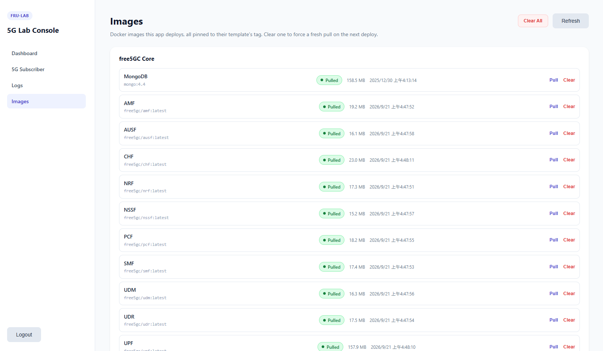
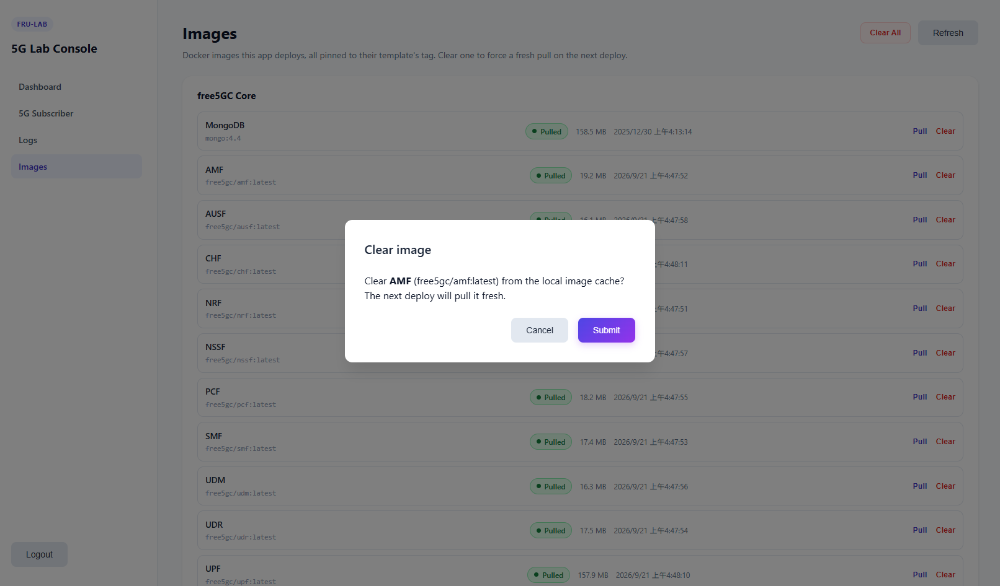

# Images Guide

The "Images" page in the sidebar manages the docker images this app deploys - the free5GC core's network functions, mongo, and the free-ran-ue image shared by gNB and UE. All of them are pinned to a fixed tag (usually `latest`) by the compose templates, so this page is where you check whether they're actually pulled locally and force a fresh pull when you want one.

## 1. Image list

Images are grouped by "free5GC Core" and "free-ran-ue". Each row shows the image's display name and its full reference (e.g. `free5gc/amf:latest`), a "Pulled" / "Not pulled" badge, and - when pulled - its size and when it was pulled.

## 2. Pull an image

Click "Pull" on any row to (re-)pull that image's pinned tag from its registry. This is a synchronous operation - the button shows "Pulling…" until the pull finishes, then the row updates with the new size and pulled time.

## 3. Clear an image

Click "Clear" on a pulled row to remove it from the local docker image cache, forcing the next deploy to pull it fresh. A confirmation dialog opens first - nothing is cleared until you press "Submit". "Clear" is disabled for an image that isn't pulled, and while a container built from that image is still running, the clear will fail with an error instead of silently breaking anything.

## 4. Clear all images

"Clear All" appears in the page header whenever at least one image is pulled, and clears every pulled image in one go - handy when you want to force a completely fresh set of pulls before a deploy. Like the single-image "Clear", it opens a confirmation dialog first.

